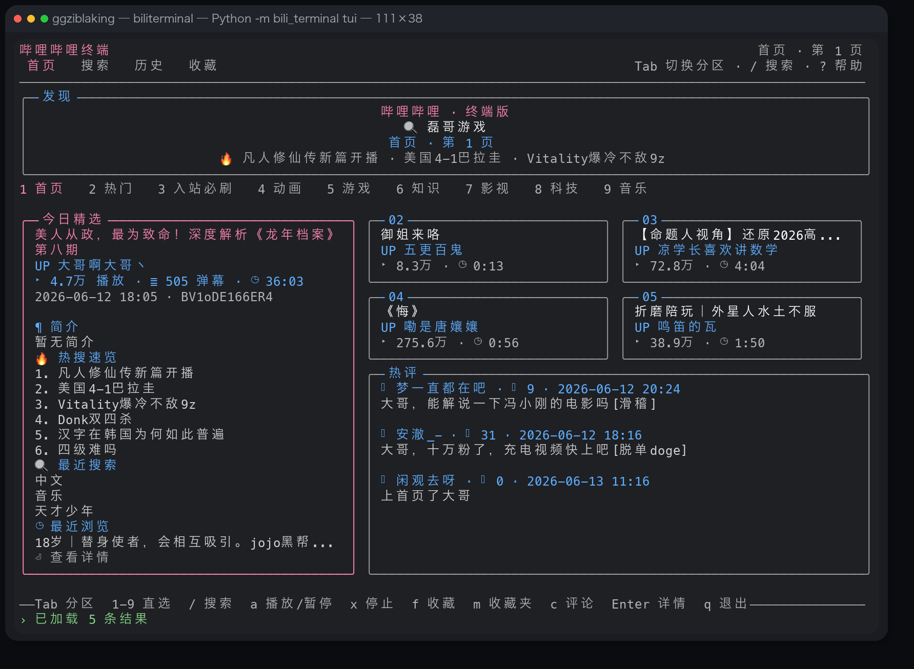
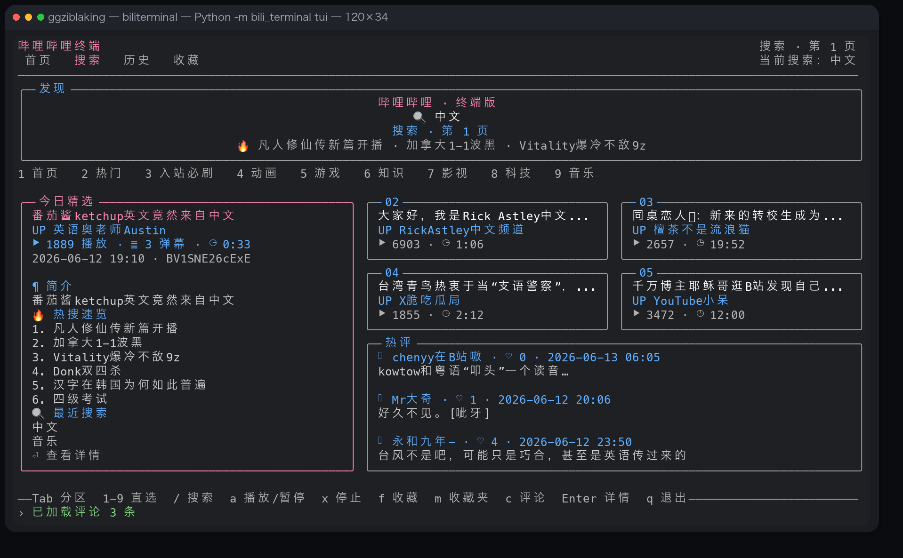
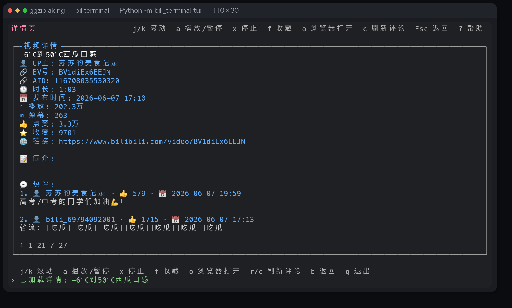

# BiliTerminal

一个轻量、低打扰、适合在终端里摸鱼刷一眼的 Bilibili 客户端。

适合上班空隙快速看首页、搜中文视频、翻评论、顺手先收藏，等有空了再去网页端继续看。

## 快速启动

macOS 双击版：

- 直接下载：<https://github.com/teee32/biliterminal/releases/latest/download/BiliTerminal-macOS.zip>
- 解压后双击 `BiliTerminal.app`

源码启动：

```bash
git clone https://github.com/teee32/biliterminal.git && cd biliterminal && ./biliterminal
```

已经 clone 下来之后：

```bash
./biliterminal                # 默认进入 legacy curses TUI
./biliterminal --legacy-tui   # 显式强制 legacy curses fallback
```

直接一键启动新版 Textual：

```bash
./biliterminal textual
./biliterminal new-tui
./biliterminal --tui
```

如果想直接启动某个命令：

```bash
./biliterminal recommend -n 5
./biliterminal rank music --day 7
./biliterminal bangumi 番剧 --index -n 5
./biliterminal search 中文 -n 5
./biliterminal audio BV19K9uBmEdx
./biliterminal audio pause
./biliterminal audio resume
./biliterminal audio stop
./biliterminal favorite BV19K9uBmEdx
./biliterminal favorites
./biliterminal favorites open 1
./biliterminal comments BV19K9uBmEdx -n 3
```

兼容方式：

```bash
python3 -m bili_terminal tui          # 旧版 legacy curses TUI
python3 -m bili_terminal textual      # 新版 Textual UI
python3 -m bili_terminal --tui        # 新版 Textual UI
python3 -m bili_terminal --legacy-tui
./bili_terminal/start.sh
./bili_terminal/start.sh textual      # 新版 Textual UI
./bili_terminal/start.sh --tui
./bili_terminal/start.sh --legacy-tui
```

自己构建 macOS 双击版：

```bash
python3 -m pip install -e '.[build]'
./bili_terminal/build_macos_app.sh
open dist/BiliTerminal.app
```

构建依赖（macOS）：

- `pyinstaller`
- `osacompile`
- `ditto`
- `clang`（用于原生音频 helper，缺失时会回退到运行时再尝试编译）

## 界面预览

下面这几张都是当前版本的真实运行截图。

### 首页流



### 搜索与评论



### 详情页



这个实现基于对 Bilibili 网页公开接口的逆向观察，当前覆盖 3 个核心能力：

- 首页推荐流
- 热门视频列表
- 入站必刷列表
- 关键词搜索
- 首页热搜词
- 视频详情查看
- 视频评论预览
- 从终端直接打开浏览器页面
- 本地收藏夹，支持稍后从浏览器继续看
- 最近搜索与最近浏览历史
- 交互式 REPL，支持基于上一次列表结果按序号继续操作
- 全屏 TUI，支持首页推荐流、分区切换、方向键浏览、回车进入详情页、历史视图、返回栈和帮助浮层
- TUI 搜索框支持直接输入中文关键词

## 运行

项目文件已经集中在 `bili_terminal/` 目录下，直接运行目录内的脚本即可。

```bash
python3 bili_terminal/bilibili_cli.py hot -n 5
python3 bili_terminal/bilibili_cli.py recommend -n 5
python3 bili_terminal/bilibili_cli.py rank --rid 3 --day 7
python3 bili_terminal/bilibili_cli.py bangumi 番剧 --index -n 5
python3 bili_terminal/bilibili_cli.py precious -n 5
python3 bili_terminal/bilibili_cli.py trending -n 10
python3 bili_terminal/bilibili_cli.py search 原神 -n 5
python3 bili_terminal/bilibili_cli.py audio BV19K9uBmEdx
python3 bili_terminal/bilibili_cli.py audio pause
python3 bili_terminal/bilibili_cli.py audio resume
python3 bili_terminal/bilibili_cli.py audio stop
python3 bili_terminal/bilibili_cli.py video BV1xx411c7mu
python3 bili_terminal/bilibili_cli.py favorite BV19K9uBmEdx
python3 bili_terminal/bilibili_cli.py favorites
python3 bili_terminal/bilibili_cli.py favorites open 1
python3 bili_terminal/bilibili_cli.py favorites remove 1
python3 bili_terminal/bilibili_cli.py history
python3 bili_terminal/bilibili_cli.py repl
python3 bili_terminal/bilibili_cli.py tui
python3 -m bili_terminal recommend -n 5
python3 -m bili_terminal rank music --day 7
python3 -m bili_terminal bangumi 番剧 --index -n 5
python3 -m bili_terminal textual
python3 -m unittest discover -s bili_terminal/tests -v
```

## macOS 双击运行

直接下载 release：

- <https://github.com/teee32/biliterminal/releases/latest/download/BiliTerminal-macOS.zip>

自己构建应用包：

```bash
./bili_terminal/build_macos_app.sh
```

构建完成后会生成两个产物：

- `dist/BiliTerminal.app`
- `dist/BiliTerminal-macOS.zip`

本机直接双击 `dist/BiliTerminal.app` 即可，或者命令行执行：

```bash
open dist/BiliTerminal.app
```

如果要发给别人，直接把 `dist/BiliTerminal-macOS.zip` 发过去，解压后双击 `.app`。

当前双击版会优先运行包内置的独立 runtime，**不再要求目标机器额外安装 `python3`**。启动日志会写到 `~/.biliterminal/launcher.log`。

分发注意事项：

- 这是 **macOS 专用** 产物
- 当前 `.app` 只做了 **ad-hoc 签名**，还**没有 Developer ID 签名 / notarization**，在别的 Mac 上第一次打开可能会被 Gatekeeper 拦截
- 当前发行物是**本机架构构建**；如果你要同时覆盖 Intel Mac 和 Apple Silicon，建议分别验证或单独做双架构发布
- 构建脚本现在会在打包后自动做一次 `launch.command --help` 烟测，确认优先走包内 runtime，而不是回退到系统 `python3`

## REPL 示例

```text
$ python3 bili_terminal/bilibili_cli.py repl
bili> hot 1 5
bili> audio 1
bili> audio pause
bili> audio stop
bili> favorite 1
bili> favorites
bili> favorites open 1
bili> video 1
bili> open 1
bili> search 原神 1 5
```

## TUI 快捷键

- `↑/↓` 或 `j/k`：移动选中项
- `Enter`：进入全屏详情视图
- `Esc` 或 `b`：从详情页返回，或回到上一个列表状态
- `/` 或 `s`：输入搜索关键词
- `Tab` / `Shift+Tab`：切换首页分区
- `1-9`：直接切到首页前 9 个分区
- `0`：直接切到第 10 个分区（当前是番剧）
- 直接输入中文即可搜索，例如 `原神`、`中文`
- `l`：重新执行最近一次搜索
- `d`：使用首页默认搜索词直接搜索
- `h`：切回首页内容流
- `v`：切到最近浏览
- `m`：切到收藏夹
- `f`：收藏 / 取消收藏当前视频
- `a`：播放 / 暂停当前视频音频
- `x`：停止当前音频
- `Ctrl+T`：深色 / 浅色主题即时切换（并写回 `~/.biliterminal/config.toml`）
- `n/p`：翻页
- `PgUp/PgDn`：在详情页滚动
- `o`：浏览器打开当前视频
- `c`：刷新当前视频评论预览
- `r`：刷新当前列表
- `?`：显示帮助浮层
- `q`：退出

## Textual v0.3.0

当前仓库已经完成 Textual 版主流程，在**不破坏现有 CLI / legacy curses TUI** 的前提下提供：

- 发布策略：默认 shell 启动仍走 legacy curses TUI，`textual` / `new-tui` 显式进入新 UI，`legacy-tui` / `--legacy-tui` 作为强制 fallback 保留
- 统一入口：`python3 -m bili_terminal ...`、仓库根目录 `./biliterminal`、以及 `bili_terminal/start.sh` 共享同一套 launch 语义
- 安装后入口：`python3 -m pip install -e .` 会注册 `biliterminal` 命令，保持与仓库脚本一致的参数行为
- 完整 Screen 流：`HomeScreen`、`SearchScreen`、`DetailScreen`、`HistoryScreen`、`FavoritesScreen`
- 统一 Widget：`VideoList`、`CommentView`、`AudioBar`
- 保留原键位语义：`↑/↓ / j/k`、`Enter`、`Esc/b`、`/ / s`、`Tab/Shift+Tab`、`1-9 / 0`、`l`、`d`、`h`、`v`、`m`、`f`、`a`、`x`、`n/p`、`PgUp/PgDn`、`o`、`c`、`r`、`?`、`q`
- 结构说明：[`docs/textual-phase1-architecture.md`](docs/textual-phase1-architecture.md)
- 兼容约束：现有 `python3 -m bili_terminal tui`、`./bili_terminal/start.sh`、macOS `.app` 打包继续保留
- 入口语义：`tui` 仍然是 legacy curses；`textual` / `new-tui` / `--tui` 才是新版 Textual UI；macOS `.app` 默认双击启动新版 Textual

启动方式：

```bash
python3 -m bili_terminal textual
./biliterminal textual
./bili_terminal/start.sh textual
```

主题配置（热重载）：

- 配置文件：`~/.biliterminal/config.toml`
- TUI 内可直接按 `Ctrl+T` 在 `dark / light` 间切换，切换后会立刻重载并持久化到配置文件
- 示例：

```toml
[ui]
theme = "light"  # dark / light
```

## 测试

```bash
python3 -m unittest discover -s bili_terminal/tests -v
```

## 说明

- CLI 会为接口补齐浏览器请求头，降低被风控 412 的概率。
- 仓库内直接运行时，搜索词和最近浏览视频会落到 `.omx/state/bilibili-cli-history.json`。
- 双击版会把历史写到 `~/.biliterminal/state/bilibili-cli-history.json`，并把启动日志写到 `~/.biliterminal/launcher.log`。
- 音频播放优先使用 `mpv` 或 `ffplay` 直连；macOS 上如果都没装，会自动走后台下载后用原生无窗体 audio helper 播放，只有 helper 不可用时才回退到 `afplay`。
- TUI 里 `a` 是当前视频的播放 / 暂停切换，`x` 会直接停止当前音频；CLI / REPL 里也支持 `audio pause`、`audio resume`、`audio stop`。
- 这是一个偏“轻量摸鱼”场景的终端浏览器，不是下载器，也没有实现登录态、投稿、评论发送、弹幕发送等需要更高权限的功能。
- 目前默认聚焦视频内容，不处理直播、课程、专栏、动态等其他内容类型。
- 终端版已经接入首页推荐、热搜、默认搜索词、入站必刷与分区榜单，但因为 curses 终端没有图片、瀑布流和登录态组件，所以还不是官网像素级复刻。

## 致谢

本项目受 [LINUX DO](https://linux.do/) 社区启发和支持。
